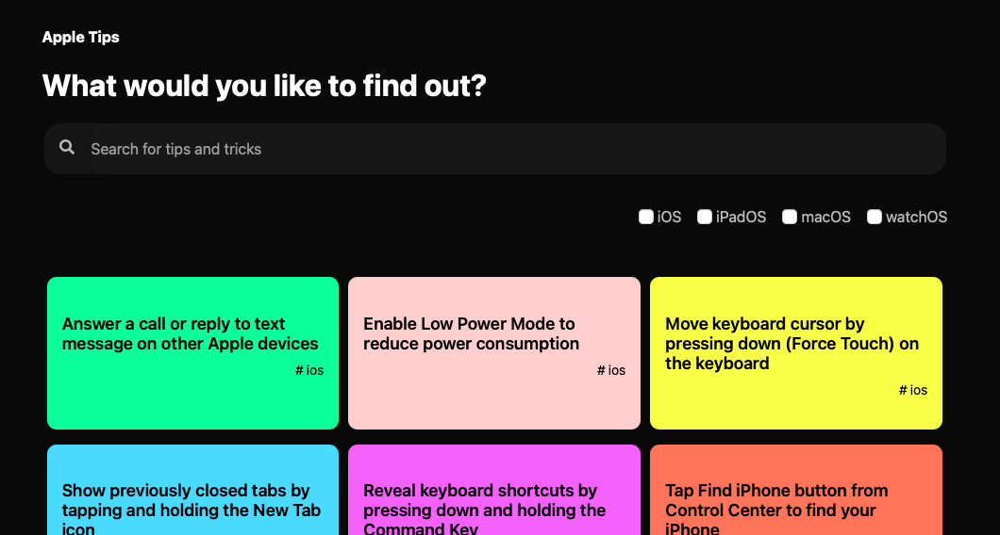
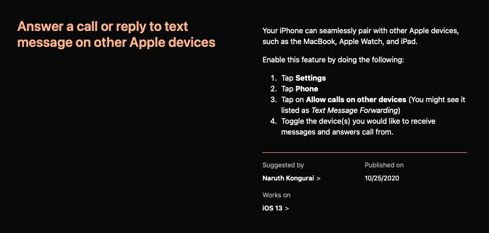
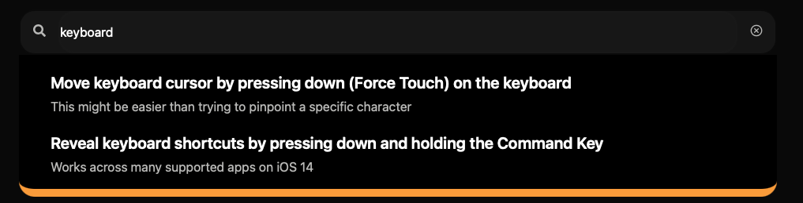

# Apple Tips



A collection of tips and tricks for people who are using Apple products and ecosystem. Beautifully designed and presented to please us Apple fans.

## Inspiration

I was heavily inspired by Dominik Ferber's [gatsby-starter-help-center](https://github.com/dferber90/gatsby-starter-help-center). His starter template allowed for an easy-to-setup Help Center. But I wanted to recreate my own version that I would have full control over its architecture and tooling. That was how Apple Tips was born.





## Development

To run this project locally, run the following commands:

```bash
git clone https://github.com/naruthk/apple-tips.git
npm install
```

```bash
gatsby develop
```

## Contributions

Please visit the [Contributions](CONTRIBUTE.md) page to learn more.

---

Built using Gatsby.js because it's awesome!.

This project was bootstrapped with [gatsby-starter-typescript-plus](https://github.com/resir014/gatsby-starter-typescript-plus).